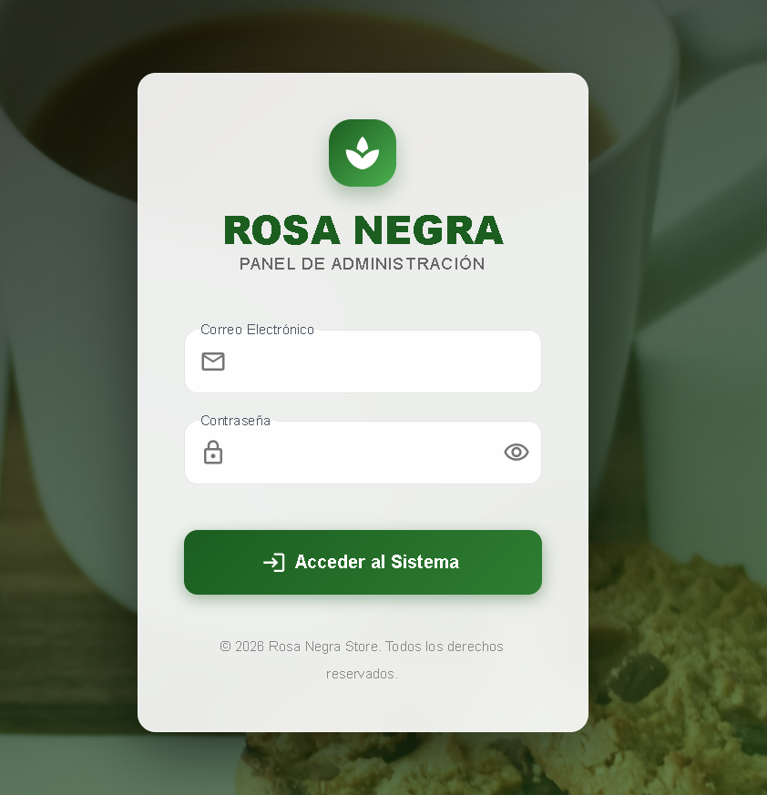
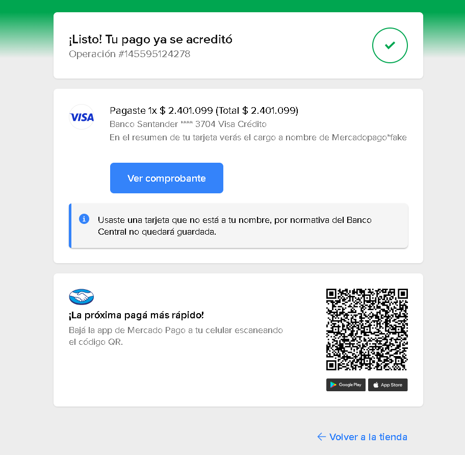
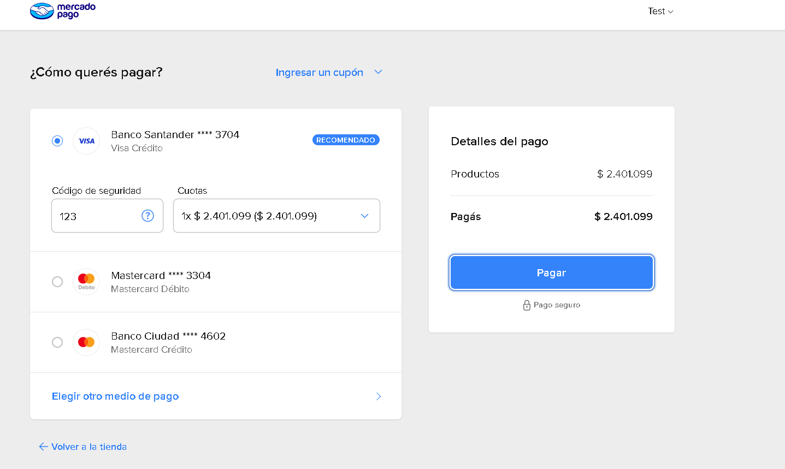
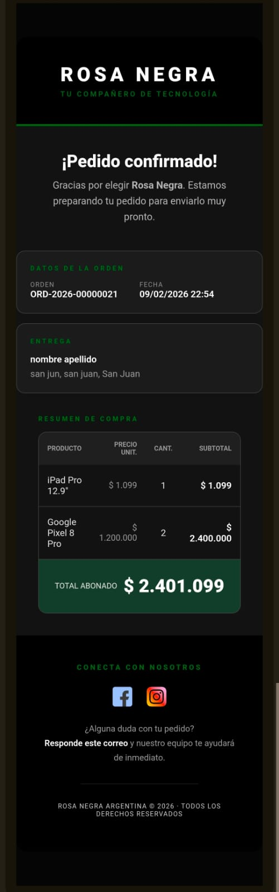
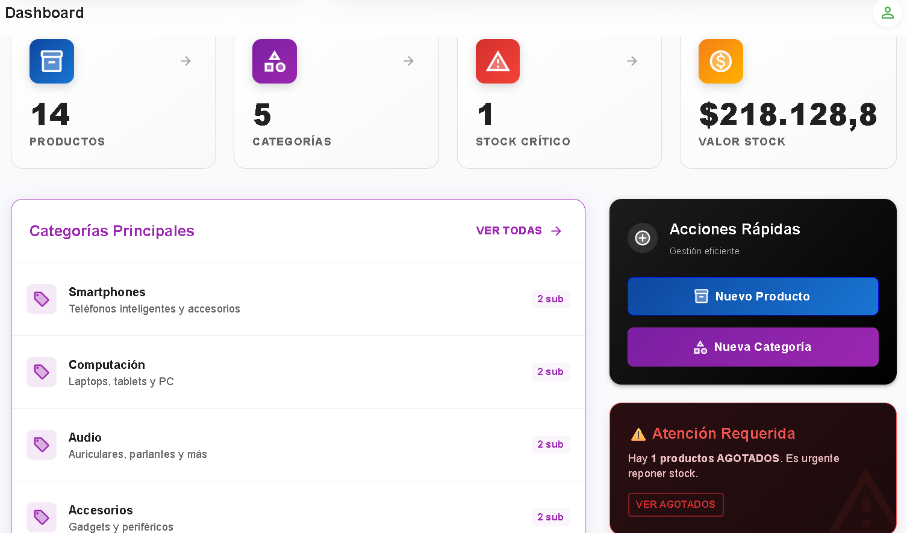
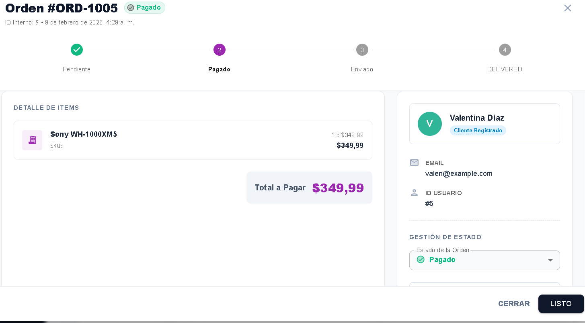
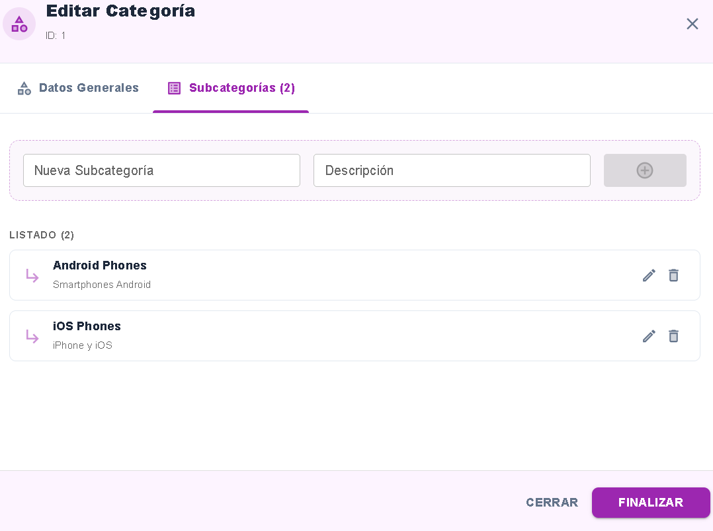
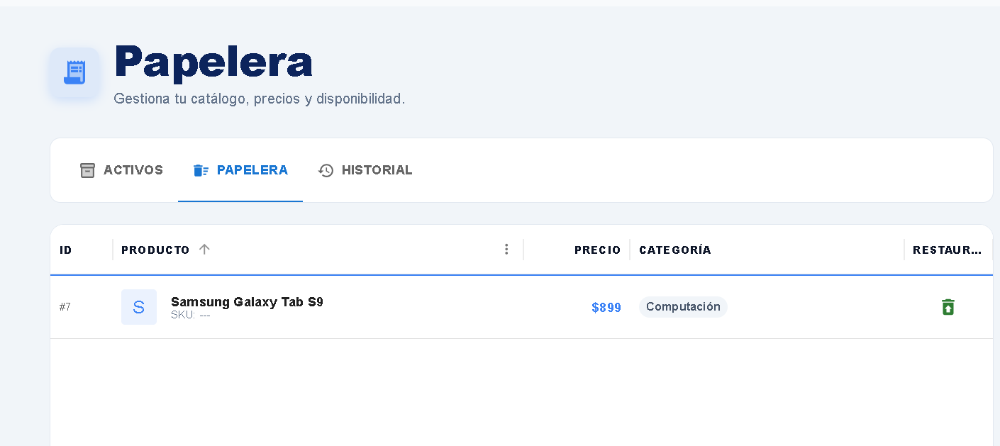
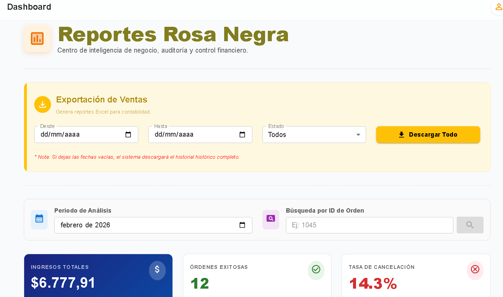
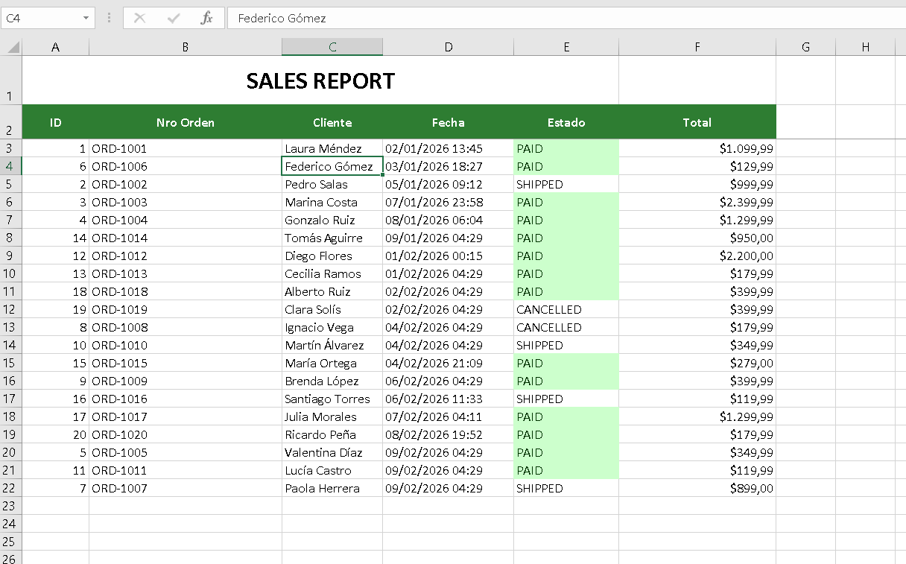

[](https://store-api-mvp.railway.app/swagger-ui.html)

## Store API – Admin Core MVP 🚀

> ⚠️ **Nota:** Este repositorio contiene el **código fuente del MVP** (núcleo técnico).
> Las imágenes mostradas más abajo ilustran cómo se vería una **versión Enterprise privada**, utilizada solo como demostración de escalabilidad, auditoría, pagos y notificaciones.

---

## 📖 Sobre el Proyecto

Este proyecto es un **MVP técnico backend-first**, enfocado en:

* Arquitectura limpia y separación de responsabilidades
* Seguridad estricta del backoffice
* Buenas prácticas en **Spring Boot 4 + JPA**

El sistema soporta:

1. **Guest Checkout:** Compra rápida sin registro para reducir fricción.
2. **Backoffice Seguro:** Gestión administrativa protegida con **JWT**, accesible solo por rol `ADMIN`.

> La ausencia de usuarios finales registrados es una **decisión de alcance del MVP**, no una limitación técnica.

---

## ⚡ Alcance: MVP vs Versión Enterprise

| Módulo / Feature    | 🟢 MVP (Código en este Repo) | 🔒 Versión Enterprise (Privada / Demo)   |
| ------------------- | ---------------------------- | ---------------------------------------- |
| **Modelo de Venta** | Guest Checkout               | Checkout con usuario registrado          |
| **Autenticación**   | JWT (Admins)                 | JWT + Refresh Token (rotación automática) |
| **Roles**           | ADMIN                        | ADMIN + USER                             |
| **Catálogo**        | ABM básico (Admin)           | Inventario avanzado, variantes, precios  |
| **Usuarios**        | Solo Admins                  | Usuarios finales + direcciones           |
| **Pagos**           | ❌ Fuera de alcance           | Integración real con Mercado Pago        |
| **Notificaciones**  | ❌ Fuera de alcance           | Emails transaccionales (Async)        |
| **Auditoría**       | Timestamps básicos           | Historial completo (SQL Window Functions) |
| **Imágenes de Producto** | Imagen única embebida en Product | Múltiples imágenes normalizadas (ProductImage 1-N)|
| **Frontend**        | ❌ No incluido                | SPA React/Vue integrada                  |

---

## 🛠️ Stack Tecnológico

* **Lenguaje:** Java 21
* **Framework:** Spring Boot 4
* **Base de Datos:** PostgreSQL
* **Transacciones:** Programmatic Transaction Management (TransactionTemplate)
* **Seguridad:** Spring Security 6 + JWT
* **Infraestructura:** Docker & Docker Compose
* **Documentación:** Swagger / OpenAPI
* **Spring Events:** ApplicationEventPublisher & @EventListener
* **Pagos:** Mercado Pago SDK (Preferencias y Webhooks)
* **Email:** Spring Boot Starter Mail (Manejo de plantillas)

---

### 🔐 Seguridad y Accesos

### 🔓 Zona Pública (Guest)

Endpoints abiertos:
* `GET /products`
* `GET /categories`
* `POST /orders` (checkout invitado)

### 🔒 Zona Privada (Backoffice)
* Requiere **JWT Bearer Token**
* Acceso exclusivo para rol `ADMIN`

Funcionalidades:
* Dashboard y métricas del sistema
* ABM completo de productos, categorías y subcategorías
* Gestión de órdenes y auditoría
* Reportes de ventas

> Swagger UI expone los endpoints administrativos **protegidos por JWT**, incluso en el entorno productivo.

---

## 🧠 Ingeniería de Datos y Consultas Avanzadas

Este MVP implementa soluciones técnicas que escalan directamente hacia una versión Enterprise:

* **Auditoría SQL nativa:** Uso de `LAG()` y `PARTITION BY` para historial de stock y precios.
* **Búsqueda flexible:** Regex PostgreSQL (`~*`) y filtros combinados.
* **Performance:** Prevención del problema N+1 con `JOIN FETCH` y proyecciones DTO.

---

## 🏗️ Ingeniería de Software y Decisiones de Arquitectura

El desarrollo de **Store API** va más allá del CRUD básico, enfocándose en consistencia, resiliencia y uso eficiente de recursos, aplicando patrones avanzados de Spring Framework.

### 1. Control Granular de Transacciones (Transaction Boundary)
A diferencia del uso estándar de `@Transactional`, utilicé un manejo programático mediante `TransactionTemplate`.
* **El Problema:** Mantener una transacción abierta mientras se consulta una API externa (Mercado Pago) bloquea una conexión del pool de la DB (**Connection Holding**).
* **La Solución:** La persistencia de la orden ocurre en una transacción atómica, pero la latencia de red de la pasarela de pagos se ejecuta **fuera** del contexto transaccional, optimizando el rendimiento bajo alta concurrencia.

### 2. Arquitectura Orientada a Eventos (EDA) con Spring Events
Utilicé el ecosistema de **Spring Events** para desacoplar el flujo principal de venta de los efectos secundarios (*side-effects*):
* **Desacoplamiento:** La creación de la orden emite un `OrderCreatedEvent`. Los listeners (Email, Carrito) reaccionan de forma asíncrona.
* **Consistencia Eventual:** Uso de `@TransactionalEventListener(phase = AFTER_COMMIT)` para asegurar que el email se envíe solo si la base de datos confirmó el pago exitosamente.

  sequenceDiagram
  participant User as Cliente (Guest)
  participant API as Store API
  participant DB as PostgreSQL
  participant Event as Spring EventBus
  participant MP as Mercado Pago

  Note over API, DB: Transacción Principal (ACID)
  User->>API: POST /orders (Checkout)
  API->>DB: Save Order (PENDING)
  API->>DB: Reserve Stock
  API->>Event: Publish OrderCreatedEvent
  API-->>User: Return 201 Created + PreferenceID

  Note over Event, MP: Procesamiento Asíncrono (Desacoplado)
  loop Async Listeners
  Event->>MP: Crear Preferencia de Pago
  Event->>DB: Log Audit Trail
  Event->>User: Enviar Email (Confirmación Pendiente)
  end


### 3. Idempotencia y Resiliencia en Pagos
El procesamiento de Webhooks incluye lógica de **idempotencia**. El sistema verifica el estado de la orden antes de procesar notificaciones, evitando errores críticos como el doble descuento de stock o envíos duplicados ante reintentos de la API.

### 4. Estrategia de Stock Optimista y Mantenimiento
* **Validación en dos pasos:** El stock se valida visualmente al inicio, pero el descuento físico ocurre únicamente tras la confirmación del pago (`PAID`).
* **Recuperación Automática:** Tareas programadas con `@Scheduled` detectan órdenes en `PENDING` por más de 24 horas y las cancelan automáticamente, liberando el inventario sin intervención humana.


---
## 🚀 Instalación y Ejecución Local

### Prerrequisitos

* Docker Desktop

### Pasos

1. **Clonar el repositorio**

```bash
git clone https://github.com/gustavito1221/store-api-java-mvp.git
cd store-api-java-mvp
```

2. **Configurar variables de entorno**

Renombrar `.env.example` a `.env` y definir:

```env
DB_USERNAME=
DB_PASSWORD=
DB_URL=
JWT_SECRET=
```

3. **Levantar la aplicación**

```bash
docker-compose up -d --build
```

4. **Probar la API**

* **Swagger local:**

    * [http://localhost:8080/swagger-ui.html](http://localhost:8080/swagger-ui.html)

* **Swagger en producción (Render):**

    * 👉 [https://store-api-java-mvp.onrender.com/swagger-ui.html](https://store-api-java-mvp.onrender.com/swagger-ui.html)

---

## 🔑 Credenciales de Prueba (Seed Data)

Para facilitar la revisión, la aplicación ejecuta un `CommandLineRunner` que precarga un usuario administrador cuando la base de datos está vacía.

Usa estas credenciales para obtener el **JWT** en `/auth/login`:

| Rol       | Email             | Contraseña | Acceso                                                   |
| --------- | ----------------- | ---------- | -------------------------------------------------------- |
| **ADMIN** | `admin@store.com` | `admin`    | Acceso total (dashboard, productos, órdenes, categorías) |
| **GUEST** | N/A               | N/A        | Lectura de catálogo y creación de órdenes                |

---

## 📸 Ejemplos Visuales (Versión Enterprise Privada)

> ⚠️ Imágenes **solo demostrativas** para ilustrar capacidades avanzadas de la versión Enterprise.

### login Admin


### Dashboard Admin


### Flujo de Checkout MP





### Email Notificación Transaccional



## 📸 Galería del Backoffice

| Dashboard Operativo | Gestión de Órdenes (State Machine) |
|:-------------------:|:----------------------------------:|
|  <br> *Métricas en tiempo real y alertas de stock.* |  <br> *Trazabilidad del ciclo de vida de la venta.* |

| Jerarquía de Datos | Auditoría (Soft Delete) |
|:------------------:|:-----------------------:|
|  <br> *Gestión de categorías anidadas.* |  <br> *Manejo de borrado lógico y restauración.* |


| Motor de Reportes y Métricas | Exportación y Documentos |
|:----------------------------:|:------------------------:|
|  <br> *Agregación de datos en tiempo real y filtros por rango de fechas.* |  <br> *Generación de documentos imprimibles y exportación a PDF.* |

---

Este repositorio expone únicamente el **núcleo técnico (MVP)** con foco en:

* Arquitectura
* Seguridad
* Buenas prácticas en Spring Boot

Su objetivo es **demostrar capacidad técnica**, no representar un producto comercial final.
